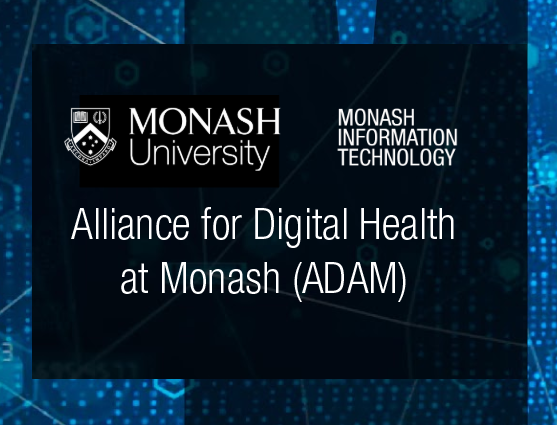

Note that ML4MI is a hybrid workshop and is a part of <a href="https://www.acml-conf.org/2022/index.html#hero">Asian Conference on Machine Learning 2022</a>. 

[//]: # ( To attend the workshop, please register for the conference.)
[//]: # (**More details are coming soon, stay tuned.**)
[//]: # (The zoom meeting link can be found at the virtual site and the gather town of ACML 2022.)

<h2>Overview</h2>

Data-driven methods have shown remarkable success in many medical imaging tasks over the past decade. With the rapid advancement of technology, novel applications and methods are on the rise. In this workshop we invite high quality papers from researchers who are exploring novel Machine Learning methods pertaining to medical image analysis tasks. While we invite papers on general medical image analysis we lay greater emphasis on recent ML techniques including but not limited to Ethical AI, Fairness of AI in Medical Imaging, Interpretability in Medical AI, Temporal Learning Strategies in Medical Vision, and Low data/ Resource Efficient Medical Image Analysis.

<h3>Topics of interest</h3>

Topics of interest include, but are not limited to:

* Data efficiency
* Transfer learning
* Domain adaptation
* Single-shot/One-shot/Few-shot learning methods
* Medical image classification/segmentation with small training dataset
* Label efficiency
* Partial annotation/label learning methods
* Weakly-supervised learning methods
* Semi-supervised learning methods
* Unsupervised learning methods
* Self-supervised learning methods
* Contrastive learning
* Neural network compression
* Knowledge distillation
* Neural architecture search
* Lightweight network design for medical image analysis
* Resource-efficient learning for real-world applications
* Model deployment on low-resource devices
* New datasets and benchmark for resource-efficient learning in medical image analysis
* Disease diagnosis, progression and treatment stratification with limited training data

<h2>Submission instructions</h2>

ML4MI invites submissions that,
* Describe preliminary work to generate discussions about recent trends and major challenges
* Describe novel and improved computational methods 
*	Address novel or impactful medical imaging tasks 
*	Propose new ML-driven computational software for medical imaging applications 
*	Describe perspectives to generate discussions about recent trends and major challenges in machine learning for medical imaging applications
*	Recently (within this year) published papers that the authors want to communicate

[//]: # (**Submission link [TBA]**: <a href="https://openreview.net/group?id=NeurIPS.cc%2F2022%2FWorkshop%2FLMRL"> Link to OpenReview</a>)

**Submission link**: <a href="https://cmt3.research.microsoft.com/ML4MI2022/Submission/Index"> Link to CMT</a>

**Format**: Anonymized <a href="https://www.acml-conf.org/2022/assets/ACML2022-camera_ready-template.zip">ACML 2022 conference template</a>. 2-4 page papers, excluding references and supplementary material (optional). The submission should be contained without the supplementary.

**Submission deadline**: Nov 24, 2022 (<a href="https://www.timeanddate.com/time/zones/aoe">any time zone</a>)

**Accept/Reject notification**: Dec 2, 2022

**Publication**:
The accepted papers will be published in the workshop’s webpage.

**Awards**: We will have awards for the best presentations, sponsored by <a href="https://www.monash.edu/it/digital-health/initiatives/adam">**ADAM: Alliance for Digital health at Monash**</a>.

<h2>Program</h2>

Detailed agenda of the workshop is presented as follows. All timings are in  Indian Standard Time (UTC+5:30).

| Time                            | Particulars                                                                                                                                                                                                                                        |
|---------------------------------|----------------------------------------------------------------------------------------------------------------------------------------------------------------------------------------------------------------------------------------------------|
| &nbsp;&nbsp;09:30 am - 09:45 am | Welcome remarks                                                                                                                                                                                                                                    |
| &nbsp;&nbsp;09:45 am - 10:30 am | Invited talk by <a href="https://scholar.harvard.edu/faisalmahmood/home"> **Dr. Faisal Mahmood**</a>, Harvard Medical School, Boston, USA                                                                                                          |
| | **Paper session 1**                                                                                                                                                                                                                                |
| &nbsp;&nbsp;10:30 am - 10:45 am | Knowledge Distillation of Convolutional Neural Networks through Feature Map Transformation using Decision Trees <a href="https://ibm.box.com/s/v4ssfc2pm2kkcb8qkejam9m0da3yzcen">[PDF]</a>                                                                                                                |
| &nbsp;&nbsp;10:45 am - 11:00 am | Image based dosimetric features for the risk assessment of cardiac disease from childhood cancer therapy <a href="https://ibm.box.com/s/7evff5dhi6xgdf5c39g29yqdaq2g5p1o">[PDF]</a>                                                                                                                                          |
| &nbsp;&nbsp;11:00 am - 11:15 am | Temporal Representation Learning Improves COVID-19 Outcome Prediction from Snapshot Images <a href="https://ibm.box.com/s/3kr82xprbaf6auauffknki28p5ohs0ks">[PDF]</a>                                                                                                                                                        |
| &nbsp;&nbsp;11:15 am - 11:30 am | Break                                                                                                                                                                                                                                              |
| &nbsp;&nbsp;11:30 am - 12:15 pm | Invited talk by <a href="https://www.drsandeepreddy.com/"> **Dr. Sandeep Reddy**</a>, Deakin University, Victoria, Australia "Translational issues with AI implementation in healthcare- How do we overcome this"                              |
| | **Paper session 2**                                                                                                                                                                                                                                |
| &nbsp;&nbsp;12:15 pm - 12:30 pm | Decision theory-inspired interpretability for deep binary medical image classification networks via reparameterization <a href="https://ibm.box.com/s/hrv817iqzsa52v2qz9ym1etthnnsms95">[PDF]</a>                                                                                                                            |
| &nbsp;&nbsp;12:30 pm - 12:45 pm | Context-Detail Transformer Network for Lung Cancer Subtyping <a href="">[PDF]</a>                                                                                                                                                                                      |
| &nbsp;&nbsp;12:45 pm - 01:00 pm | Artifact Removal in Histopathology Images <a href="https://ibm.box.com/s/q1c790tmuh7dq9h929e4uo9nfol847gb">[PDF]</a>                                                                                                                                                                                                         |
| &nbsp;&nbsp;01:00 pm - 01:30 pm | Break                                                                                                                                                                                                                                              |
| &nbsp;&nbsp;01:30 pm - 02:15 pm | Invited talk by <a href="https://www.linkedin.com/in/swapnil-rane-034b0322/?originalSubdomain=in"> **Dr. Swapnil Rane**</a>, Tata Memorial Centre, Mumbai, India "Digital Pathology, Medical applications of AI/ML and Cancer Imaging Biobank" |
| &nbsp;&nbsp;02:15 pm - 03:15 pm | Keynote talk by <a href="https://www.dkfz.de/en/imsy/team/people/Lena_Maier-Hein.html"> **Dr. Lena Maier-Hein**</a>, German Cancer Research Center, Hamburg, Germany "Beyond AI success stories"                                               |
| &nbsp;&nbsp;03:15 pm - 03:30 pm | Closing remarks                                                                                                                                                                                                                                    |

<h2>Organizers</h2>

<ul>
  <li><a href="https://sites.google.com/site/dwarikanathmahapatra/"> Dwarikanath Mahapatra</a>, Inception Institute of Artificial Intelligence, Abu Dhabi, UAE</li>
  <li><a href="https://bmi.stonybrookmedicine.edu/people/prateek_prasanna"> Prateek Prasanna</a>, Stony Brook University, New York, USA</li>
  <li><a href="https://www.linkedin.com/in/pushpakpati/"> Pushpak Pati</a>, IBM Research, Zurich, Switzerland</li>
  <li><a href="https://www.linkedin.com/in/maria-vakalopoulou-8a709395/?originalSubdomain=gr"> Maria Vakalopoulou</a>, University Paris-Saclay, Paris, France</li>
  <li><a href="https://www.ee.iitb.ac.in/web/people/faculty/home/asethi"> Amit  Sethi</a>, Indian Institute of Technology, Bombay, India</li>
  <li><a href="https://research.monash.edu/en/persons/yasmeen-george"> Yasmeen George</a>, Monash University, Melbourne, Australia</li>
</ul>

<h3>Contact</h3>

Please email <a href="mailto:dwarikanath.mahapatra@inceptioniai.org">dwarikanath.mahapatra@inceptioniai.org</a> for more information.

